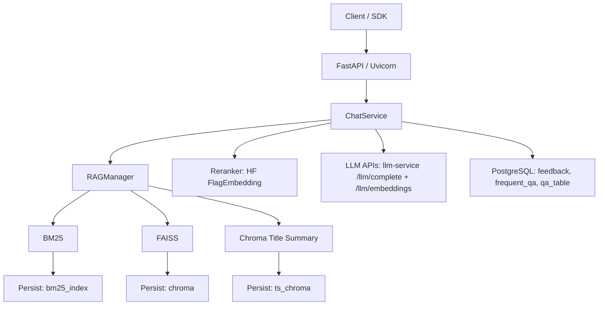

# RAG Agent Production

<p align="center">
  
</p>

<p align="center">
  
  
  
  
  
</p>

A production-ready RAG Agent service that supports multi-retrieval integration (BM25/FAISS/header summary), pluggable reorderers (Hugging Face/FlagEmbedding), and provides a REST API and log/feedback management.

## News

2025/04/20 ? 2025/08/13 ?? We released and iterated the FinSage paper on arXiv (arXiv:2504.14493), from v1 (2025/04/20) to v4 (2025/08/13).

2025/08/11 ?? Our paper was accepted to ACM CIKM 2025 (Applied Research Track) (notification date).

<!-- START doctoc generated TOC please keep comment here to allow auto update -->
<!-- DON'T EDIT THIS SECTION, INSTEAD RE-RUN doctoc TO UPDATE -->
## Contents

* [Usage](#usage)
* [Configuration](#Configuration)
* [API](#api)
* [Production Environment Deployment](#Production Environment Deployment)
  * [Start API Server](#Start API Server)
  * [Shut down service](#Shut down service)
  * [View Log](#View Log)
  * [Module Testing](#Module Testing)
* [Results](#results)
* [Citation](#citation)
<!-- END doctoc generated TOC please keep comment here to allow auto update -->

---

## Performance on the company dataset.
"Avg Num Retrieved" represents the average number of chunks in the retrieved set. Recall, Precision, and F1 scores are calculated based on the relevant chunks retrieved. The bold denotes the best Recall, Precision and F1 produced from FinSage.

| Category | Method | Avg Recall | Avg Precision | Avg F1 | Avg Num Retrieved |
| ------------------- | -------------------------------- | ---------- | ------------- | ---------- | ----------------- |
| **FAISS Retrieval** | FAISS (Baseline) | 0.8194 | 0.0941 | 0.1646 | 75.6 |
| | + Bundle Expansion (Exp) | 0.8103 | 0.0999 | 0.1733 | 70.25 |
| **BM25 Retrieval** | + BM25 | 0.8452 | 0.1147 | 0.1949 | 66.24 |
| | + Metadata | 0.8573 | 0.1198 | 0.2037 | 64.87 |
| **HyDE Retrieval** | HyDE-1: HyDE(Qwen7B) | 0.8228 | 0.1076 | 0.1830 | 69.09 |
| | HyDE-2: HyDE(Qwen7B-SFT) | 0.8567 | 0.1072 | 0.1831 | 72.92 |
| | HyDE-3: HyDE(Qwen72B) | 0.8323 | 0.1078 | 0.1844 | 69.77 |
| **FinSage** | + BM25 + Metadata + HyDE-2 + Exp | **0.9251** | **0.1272** | **0.2156** | 68.75 |

---


## Architecture Diagram



## Usage

- Quick Start
  1. Prepare configuration in `.env` (copy from `.env.example`) and set `CHROMA_SERVER_HOST` / `CHROMA_SERVER_PORT`, Postgres (`POSTGRES_HOST`, …, `POSTGRES_DATABASE`; optional `POSTGRES_MAX_CONNECTIONS`), `LLM_SERVICE_BASE_URL`, and `BEARER_TOKEN`. You may set `DATABASE_URL` instead to use a single connection string.
  2. Ensure PostgreSQL is running and the database exists, then apply migrations from the project root: `alembic upgrade head`. (See [PostgreSQL and Alembic](#postgresql-and-alembic) below.)
  3. Start the Chroma server (when using client-server): `chroma run --path /path/to/chroma_data` (default port 8000).
  4. Start the LLM service and ensure `POST /llm/complete` and `POST /llm/embeddings` are available. Configure `llm_service_base_url`, `llm_service_provider`, `llm_model_name`, and `embeddings_model_name`.
  5. Start the API service (requires [uv](https://docs.astral.sh/uv/) and dependencies: `uv sync` from project root).

   **From the `src` directory** (recommended):

   ```bash
   cd src
   uv run uvicorn server:app --host 0.0.0.0 --port 6005 --timeout-keep-alive 180
   ```

   **From the project root** (set `PYTHONPATH` so the `server` module and `utils` resolve):

   ```bash
   PYTHONPATH=src uv run uvicorn server:app --host 0.0.0.0 --port 6005 --timeout-keep-alive 180
   ```

   Default port is 6005; override with the `PORT` environment variable. API docs (when the server is running): `http://127.0.0.1:6005/docs`.

  6. API calls: see the [API](#api) section below.

- Reranker weights
  - Publish your reranked model to Hugging Face and set `rerank_model` to the repository ID (or local path) in the configuration. For example: `BAAI/bge-reranker-v2-gemma`.
  - The number of chunks that ultimately participate in answer generation is controlled by `rerank_topk`.

## Configuration

The service uses `.env` as the single configuration source (loaded by `src/config.py`).

<details>
<summary>Example (Key Fields)</summary>


```yaml
# PostgreSQL (feedback, frequent_qa_pairs, qa_table). Composed from POSTGRES_* or DATABASE_URL — run: alembic upgrade head
# POSTGRES_HOST, POSTGRES_PORT, POSTGRES_USER, POSTGRES_PASSWORD, POSTGRES_DATABASE, POSTGRES_MAX_CONNECTIONS (pool size)

# Chroma client-server mode (recommended). Start Chroma with: chroma run --path /path/to/chroma_data
chroma_server_host: "localhost"
chroma_server_port: 8000

# Base path for file-based storage (BM25 index). With client-server, Chroma data lives on the Chroma server.
persist_directory: "/path/to/database_root"

embeddings_model_name: "BAAI/bge-m3"

llm_model_name: "Qwen/Qwen2.5-72B-Instruct-AWQ"
llm_service_base_url: "http://127.0.0.1:8001" # LLM service base URL
llm_service_provider: "openai" # provider alias expected by /llm/complete
llm_service_embeddings_provider: "openai" # optional override for /llm/embeddings

rerank_model: "BAAI/bge-reranker-v2-gemma" # You can enter your HF repository ID
rerank_topk: 5

frequent_qa_directory: "/path/to/frequentQA.db" # Optional
qa_table_directory: "/path/to/qa_table.db" # Optional
qa_table_persist_directory: "/path/to/qa_chroma_dir" # Optional (ignored when chroma_server_host is set)

log_level: "INFO" # DEBUG/INFO/WARNING/ERROR/CRITICAL
bearer_token: "<your_token>" # Or provided via the environment variable BEARER_TOKEN
```

</details>

#### PostgreSQL and Alembic

The app uses PostgreSQL for feedback, frequent QA, and qa_table. Configure `POSTGRES_*` in `.env` (or `DATABASE_URL` as a single override). The API SQLAlchemy pool size follows `POSTGRES_MAX_CONNECTIONS` (default `12`, no overflow connections). From the project root:

- **Apply all migrations (create/update tables):**
  ```bash
  alembic upgrade head
  ```
- **After changing `src/models.py`, generate a new migration and apply it:**
  ```bash
  alembic revision --autogenerate -m "describe your change"
  alembic upgrade head
  ```

Alembic uses the same resolution as runtime: `.env` `POSTGRES_*` fields (or optional `DATABASE_URL`).

#### LLM Gateway

This service does not call LLM providers directly from `src/`.

- All runtime LLM requests are routed through the LLM service `POST /llm/complete`.
- All runtime embedding requests are routed through the LLM service `POST /llm/embeddings`.
- Configure these keys in `.env`:
  - `llm_service_base_url`
  - `llm_service_provider`
  - `llm_service_embeddings_provider` (optional)
  - `llm_model_name`
  - `embeddings_model_name`
- Optional provider overrides:
  - `feedback_classifier_provider` (for feedback classification jobs)
  - `treerag_llm_provider` (for TreeRAG planner/answer calls)

You can inspect the contract in `openapi/llm_service_openapi.json`.

#### Chroma (client-server)

**Chroma (client-server):** When `chroma_server_host` is set, the app uses [Chroma’s HTTP client](https://docs.trychroma.com/guides/deploy/client-server-mode) and connects to a Chroma server. Start the server with `chroma run --path /path/to/chroma_data` (default port 8000). Main and title-summary collections are created as `<collection_name>` and `<collection_name>_ts` on the server. If `chroma_server_host` is omitted, Chroma falls back to local files under `persist_directory` (chroma/ and ts_chroma/).

**Chroma thin client:** The project depends on [chromadb-client](https://docs.trychroma.com/guides/deploy/python-thin-client) (lightweight HTTP-only client) for client-server mode. For a minimal install when using only Chroma server (no local Chroma), run `uv pip uninstall chromadb` after `uv sync`. For local Chroma persistence, install the optional group: `uv sync --extra chroma-local`.

**Notice:**
- With **Chroma client-server**: `persist_directory` is used only for `bm25_index/<collection_name>/`. Chroma data lives on the Chroma server.
- With **local Chroma**: `persist_directory` should contain `chroma/`, `ts_chroma/`, and `bm25_index/<collection_name>/`.
- Collections are discovered from Chroma at startup (or configured via `collections_top_k`).

## API

- **Health check**

  ```bash
  curl http://127.0.0.1:6005/health
  ```

- **Token verification**

  ```bash
  curl -H "Authorization: Bearer <your_token>" http://127.0.0.1:6005/api/check_token
  ```

- **Synchronous Q&A**

  ```bash
  curl -X POST http://127.0.0.1:6005/api_chat \
    -H "Authorization: Bearer <your_token>" \
    -H "Content-Type: application/json" \
    -d '{"collection_name":"lotus","question":"Your question here","session_id":"test-session"}'
  ```

- **Streaming Q&A (SSE)**

  ```bash
  curl -N -X POST http://127.0.0.1:6005/api_chat_stream \
    -H "Authorization: Bearer <your_token>" \
    -H "Content-Type: application/json" \
    -d '{"collection_name":"lotus","question":"Your question here","session_id":"test-session"}'
  ```

## Production Environment Deployment

### Start the API Server

1. (Optional) Enter or create a screen session: `screen -S api` then reattach later with `screen -r api`.
2. Start the service (from project root or from `src`):

   ```bash
   cd src
   uv run uvicorn server:app --host 0.0.0.0 --port 6005 --timeout-keep-alive 180
   ```

   Or in one line from project root: `cd src && uv run uvicorn server:app --host 0.0.0.0 --port 6005 --timeout-keep-alive 180`.

3. Detach from the screen session with `Ctrl-a` then `d`.

### Shut down the service

#### 1. Close the app
1. Use `lsof -i :6005` to find the PID of the app.
2. `kill [pid]`

#### 2. Disable vllm
1. Use `ps aux | grep vllm` to find the process corresponding to starting vllm.
2. `kill -2 [pid]` sends a SIGINT signal to complete the cleanup.

### View Log

#### 1. App Logs
1. `src/server.log`
2. Backup directory (will attempt to copy upon receiving an exit signal or when the process terminates): `/root/autodl-tmp/server_logs`

#### 2. LLM Service Logs

Please refer to the logs of your deployed LLM service that serves `/llm/complete`.

#### 3. User Feedback Log

* `log/error`: User feedback issues and session log
* Feedback and ratings are stored in PostgreSQL (see `POSTGRES_*` / `DATABASE_URL` and [PostgreSQL and Alembic](#postgresql-and-alembic)).
* Low-rating (`rating <= 2`) review payloads are appended locally to `logs/low_rating_feedback.jsonl` (one JSON object per line). No external low-rating webhook is called.

### Module Testing

#### Ensemble Retriever Test

  ```bash
  cd src
  uv run python -m utils.ensembleRetriever
  ```

## Results

### 5.1 Multipath Retrieval (MPR) Results

FinSage significantly outperforms single-path solutions through its multi-path sparse-dense retrieval architecture. Compared to single-path FAISS or BM25, multi-path solutions (FAISS/BM25/title and abstract retrieval, etc.) achieve higher recall and more stable precision with the same candidate size, demonstrating the advantages of Mix-of-Retrievers.

### 5.2 Document Reordering (DRR) Results

Compared to the general reranker (bge-reranker-v2-Gemma), the task-adaptive trained dedicated reranker significantly outperforms in both Top-5 and Top-10 configurations, improving recall by approximately 15% and effectively filtering irrelevant segments, while also showing a significant increase in precision. Furthermore, as the number of output chunks increases, precision/MRR/nDCG tend to decrease, confirming the experience that "5-10 chunks are usually sufficient."

R=5 (5 candidates per searcher):

| Settings | Precision | Normalized Recall | MRR | Binary nDCG |
|-----------------------|-----------|-------------------|--------|-------------|
| Top-5 BGE | 0.5913 | 0.6043 | 0.6570 | 0.7540 |
| Top-5 Training Reorderer | 0.7324 | 0.7456 | 0.7078 | 0.8124 |
| Top-10 BGE | 0.3771 | 0.6881 | 0.3854 | 0.6011 |
| Top-10 Training Reorderer | 0.4424 | 0.7783 | 0.3338 | 0.6097 |

R=10 (10 candidates per searcher):

| Settings | Precision | Normalized Recall | MRR | Binary nDCG |
|-----------------------|-----------|-------------------|--------|-------------|
| Top-5 BGE | 0.6028 | 0.6130 | 0.6540 | 0.7638 |
| Top-5 Training Reorderer | 0.7878 | 0.7910 | 0.7545 | 0.8533 |
| Top-10 BGE | 0.4133 | 0.5985 | 0.4533 | 0.6285 |
| Top-10 Training Reorderer | 0.5657 | 0.8196 | 0.5155 | 0.6958 |

### 5.3 End-to-end Question and Answer Results (LLM/Human)

The ones marked with "?" are our experiments; the others are from the original paper.

| Dataset | Method | LLM | Manual |
|--------------|--------------------------------|-------|--------|
| FinanceBench | Islam et al. | - | 0.1900 |
| FinanceBench | Jimeno-Yepes et al. | 0.3262| 0.3688 |
| FinanceBench | Setty et al. | 0.2560| - |
| FinanceBench | FinSage* | 0.4966| 0.5705 |
| Company | FinSage* | 0.8533| 0.8800 |

### 5.4 Comparison with the RAG Spectrum Scheme

Response latency (seconds):

| Method | Mean | Median | Min | Max |
|-----------|-------|--------|------|--------|
| GraphRAG | 16.90 | 15.27 | 9.86 | 40.67 |
| LightRAG | 12.16 | 8.84 | 3.41 | 859.51 |
| FinSage | 19.34 | 18.57 | 8.57 | 40.02 |

Faithful rating:

| Method | Number of Questions | Mean | Median | Min | Max | Pass % |
|-----------|------------------|------|--------|-----|-----|---------|
| GraphRAG | 71 (including 4 failures) | 3.46 | 3.50 | 2.0 | 5.0 | 42.50% |
| LightRAG | 75 | 2.45 | 2.00 | 1.0 | 5.0 | 13.67% |
| FinSage | 75 | 4.31 | 5.00 | 1.0 | 5.0 | 82.67% |

### 5.5 System Efficiency and Cost Estimation

| Steps | Process | Time (s) | Model | Token Estimation | Cost Estimation |
|------|---------------------------|---------|------------|------------------------|--------------------------|
| 1 | Query Rewrite | ~2.5 | GPT-4o | ~1200 | ~$0.005 |
| 2 | HyDE (per subproblem, asynchronous) | ~4.2 | GPT-4o | ~500 | ~$0.002 ? n |
| 3 | Search and Reorder | ~4.7 | Local | N/A | 24GB GPU |
| 4 | Sub-problem answering (asynchronous) | ~4.7 | GPT-4o | ~2500 | ~$0.012 ? n |
| 5 | Final Answer Combined | ~1.7 | GPT-4o | ~200 + 200 ? n | ~$0.002 + $0.002 ? n |
| ? | Total | ~13?17 | ? | ~3.7k + 3k ? n | ~$0.017 + $0.016 ? n |

Note: n is the number of subproblems.

### 5.6 Retrieval Delay

| Method | Avg Time (s) |
|-------------------|--------------|
| FAISS | 0.057 |
| Metadata (FAISS) | 0.050 |
| BM25 | 0.014 |
| Total | 0.121 |

### 5.7 Problem Category Distribution and Average Score

| Category | Quantity | Percentage | Average Score |
|-------------------------------|------|--------|--------|
| business_products_competition | 952 | 38.4% | 4.23/5 |
| basic_info_equity_structure | 765 | 30.8% | 4.22/5 |
| financial_status_Performance | 697 | 28.1% | 3.88/5 |
| regulatory_policy | 68 | 2.7% | 4.40/5 |

## Related Projects

* [RAG-based Financial Question Answering](https://github.com/OpenGVLab/RAG-FinancialQA)
* [MLC LLM](https://github.com/mlc-ai/mlc-llm)

## Citation

If you use **FinSage** in your research, please cite the paper:

```
@article{FinSage,
  title={FinSage: A Multi-aspect RAG System for Financial Filings Question Answering},
  author={Wang, Xinyu and Chi, Jijun and Tai, Zhenghan and Kwok, Tung Sum Thomas and Li, Muzhi and others},
  journal={arXiv preprint arXiv:2504.14493},
  year={2025}
}
```